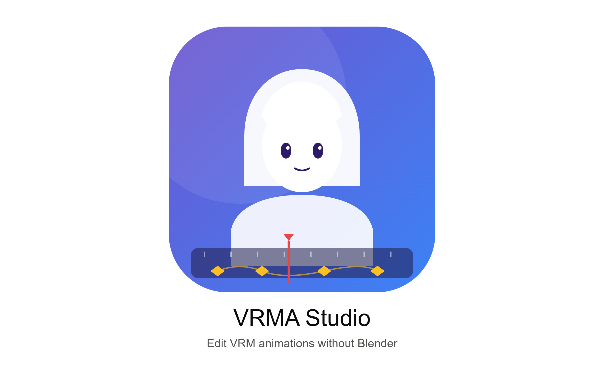

# VRMA Studio

**A desktop editor for VRM Animation (`.vrma`) files with a familiar video-editor workflow.**

[](https://github.com/Kanee18/VRMA-studio/releases/latest)
[](https://github.com/Kanee18/VRMA-studio/actions/workflows/release.yml)

Open a `.vrma` file, watch it play on a VRM avatar instantly, cut and trim it on a
timeline, and export a spec-compliant `.vrma` — no Blender, no Unity, and no rigging
knowledge required.





## Who is this for?

Editing a VRM animation today usually means importing it into Blender through a
fragile add-on, even for a simple cut. VRMA Studio is built for the people who just
need the edit:

- **VTubers** and virtual-assistant developers working with VRM avatars
- **Indie game developers** using VRM/VRMA pipelines (Three.js, Godot, RPG Developer Bakin)
- **Motion-capture users** (XR Animator, VRM Posing Desktop) who need post-editing
- Anyone who has never opened Blender and would like to keep it that way

## Features

- **Instant preview** — load a `.vrm` model and a `.vrma` animation and it plays
  immediately in a 3D viewport with orbit controls
- **Timeline editing** — trim clip edges, split at the playhead, razor-cut, and
  ripple-trim, with magnetic snapping to frames, edit points, and the playhead
- **Frame-accurate transport** — timecode readout, frame stepping, edit-point
  navigation, loop playback, and full keyboard control
- **Undo / redo** for every edit
- **Validation on import and export** — problems are reported in plain language,
  never as raw stack traces
- **Round-trip safety** — an unedited import → export produces a functionally
  identical animation, guaranteed by the test suite

### Roadmap

- Merging multiple animations with optional crossfade blending
- Per-clip speed adjustment and reverse
- Independent lanes for body, expressions, and look-at
- Auto-repair for malformed VRMA files

## Download

Grab the latest Windows installer (`.exe`) from the
[**Releases**](https://github.com/Kanee18/VRMA-studio/releases/latest) page and run it.

## Keyboard shortcuts

| Key | Action |
| --- | --- |
| `Space` | Play / pause |
| `V` / `C` | Selection tool / razor tool |
| `S` | Split clip at playhead |
| `Q` / `W` | Ripple-trim clip head / tail to playhead |
| `←` / `→` | Step one frame (`Shift` steps one second) |
| `↑` / `↓` | Jump to previous / next edit point |
| `Home` / `End` | Go to start / end |
| `+` / `-` | Zoom timeline in / out |
| `Del` | Delete selected clip |
| `Ctrl+Z` / `Ctrl+Y` | Undo / redo |
| `Ctrl+E` | Export |
| `Esc` | Deselect / close dialog |

## How it works

A `.vrma` file is a glTF binary (`.glb`) carrying the
[`VRMC_vrm_animation`](https://github.com/vrm-c/vrm-specification/tree/master/specification/VRMC_vrm_animation-1.0)
extension, which maps animation channels onto VRM humanoid bones so a single
animation retargets across any VRM model. VRMA Studio parses that container into an
internal document model, performs all edits there, and regenerates a valid `.glb`
from scratch on export — buffers, accessors, and extension data included. Details and
spec deviations are documented in [docs/format-notes.md](./docs/format-notes.md).

## Development

Prerequisites: [Node.js](https://nodejs.org) 20+ and, for the desktop shell,
[Rust](https://rustup.rs).

```sh
npm install
npm run dev          # web preview in the browser (no Rust needed)
npm run tauri dev    # desktop app with hot reload

npm test             # regenerates test fixtures, runs the Vitest suite
npm run typecheck    # strict TypeScript check
npm run tauri build  # production build + Windows installers
```

### Project layout

| Path | Purpose |
| --- | --- |
| `src/core/` | Pure TypeScript VRMA engine — parser, writer, validator, edit operations. No UI dependencies; fully unit-tested. Binary buffer math lives in `src/core/vrma/glb.ts`. |
| `src/viewport/` | Three.js scene, VRM playback, transport bar |
| `src/timeline/` | Timeline UI — ruler, clips, tools, snapping |
| `src/panels/` | Project panel, properties panel, export dialog |
| `src/app/` | App shell, Zustand store, keyboard shortcuts |
| `src-tauri/` | Tauri (Rust) desktop shell |
| `tests/` | Vitest suites and generated `.vrma` fixtures |

### Releasing

Pushing a tag that starts with `v` (for example `v0.1.0`) triggers the
[release workflow](.github/workflows/release.yml), which builds the Windows
installers and attaches them to a draft GitHub Release — review the draft, then
publish it.

## Built with

[Tauri](https://tauri.app) · [React](https://react.dev) ·
[TypeScript](https://www.typescriptlang.org) · [Three.js](https://threejs.org) ·
[@pixiv/three-vrm](https://github.com/pixiv/three-vrm) · [Zustand](https://zustand.docs.pmnd.rs) ·
[Tailwind CSS](https://tailwindcss.com) · [Vitest](https://vitest.dev)

## Acknowledgements

- The [VRM Consortium](https://vrm.dev) for the VRM and VRM Animation specifications
- [pixiv](https://github.com/pixiv) for `three-vrm` and `three-vrm-animation`
